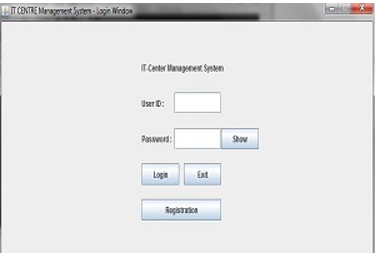
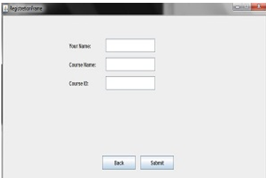

# It_training_management_system-using-Java
## Introduction

Our project is “It-center Management system “. To reduce the problem to handle  employees and student and to trace purchase information easily we have done the project.
By our project the manager of it-centre can easily handle his or her employee and student . and Student can easily contact with the employees of it center. 

## User Category

There are two types of Users here. They are:

<ul>
  <li>Employee type user</li>
  <li>Student type user</li>
</ul>

## Feature List

In this project the “Employee  type user” has the following features:

<ul>
  <li>Manager  can  manage all the employees</li>
  <li>Manager and all employees can change password</li>
  <li>Manager and all employees can manage all course</li>
  <li>Manager and all employees can manage students</li>
  <li>Manager and all employees can update his or her details</li>
  <li>Manager and all employees can manage purchase details</li>
</ul>

In this project the “Student type user” has the following features:

<ul>
  <li>Can see his or her details</li>
  <li>Can change password</li>
</ul>

## GUI Description

In this gui users can   longin  and can go to registration gui.

Students can register themselves  in this gui

In  this gui Manager  can  manage all the employees .Manager and all employees can change password.Manager and all employees can manage all course

In this gui student type  user can see their id and name. Student type user  can  change  their password.

n this gui Student type user  can  change  their password.

## Database Table Description

## Class Diagram

## Tools Used

To develop this project we have used the following:

<ul>
  <li>jdk</li>
  <li>xampp</li>
  <li>.jar </li>
  <li>notepad ++</li>
</ul>

## OOP and Java Concepts Used
<ul>
  <li>Concept 1: Encapsulation  :  we have given setter and getter method for all the attributes of classes.which is known  as encapsulation because we bound a 
  setter and getter method with an attribute </li>
  <li>Concept 2: Gui:we have used gui for user interfaces.</li>
  <li>Database: we have used database for storing the date</li>
</ul>

## Impact of this Project
<ul>
  <li>Can know about it related course easily</li>
  <li>The society will get information about Information and technology</li>
  <li>It centre owner as well as the employees of it center will benefited as the can handle a lot of student easily</li>
</ul>

How will people be benefitted from your project?

The people of  the society can get service from It-center and  It-centre can  provide better service.
Employee can easily handle their jobs and other stuffs. Student can get information about it related course easily.
It center will be benifited because they can handle  a lot of student easily and can earn a good amount of  profit.

## Limitations and Possible Future Improvements

There is no specific options for trainer.Student can only change their password .courses can not be deleted. 
purchase infor mation  and student information cannot be deleted. In future we will try to over come these limitation and will provide better facilities.

